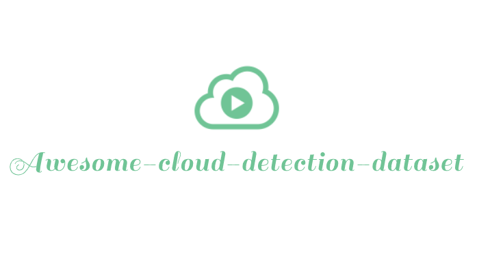

     
        
     

## Awesome cloud detection dataset  
> A list of cloud detection dataset

### Landsat series
- [SPARCS](http://emapr.ceoas.oregonstate.edu/sparcs/)
- [Biome](https://landsat.usgs.gov/landsat-8-cloud-cover-assessment-validation-data?msclkid=97441d71b4b611ec83b9d816c63a8916)
- [38cloud](https://github.com/SorourMo/38-Cloud-A-Cloud-Segmentation-Dataset)
- [95-cloud](https://github.com/SorourMo/95-Cloud-An-Extension-to-38-Cloud-Dataset)

### Gaofen series
- [GF1-WHU](http://sendimage.whu.edu.cn/en/mfc-validation-data/)
- [AIR-CD](https://github.com/AICyberTeam/AIR-CD)

### Sentinel series
- [WHUS2-CD](https://github.com/Neooolee/WHUS2-CD)
